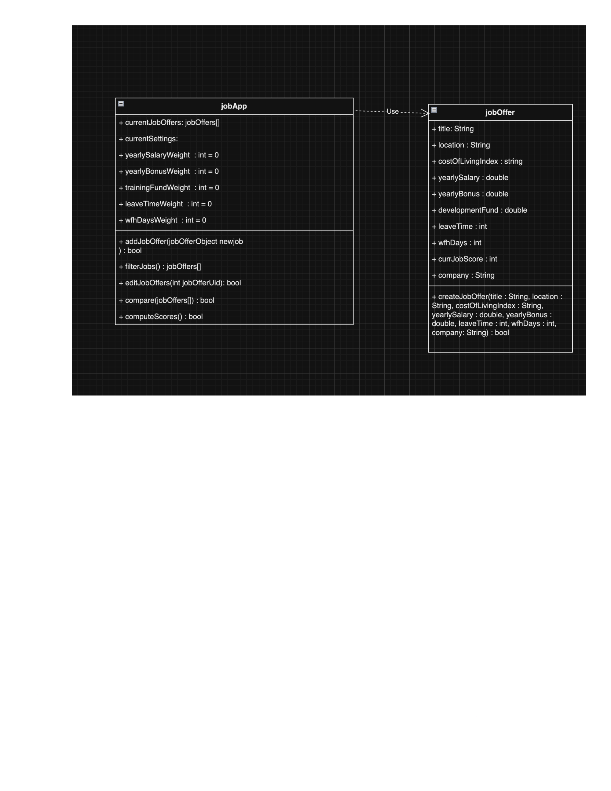
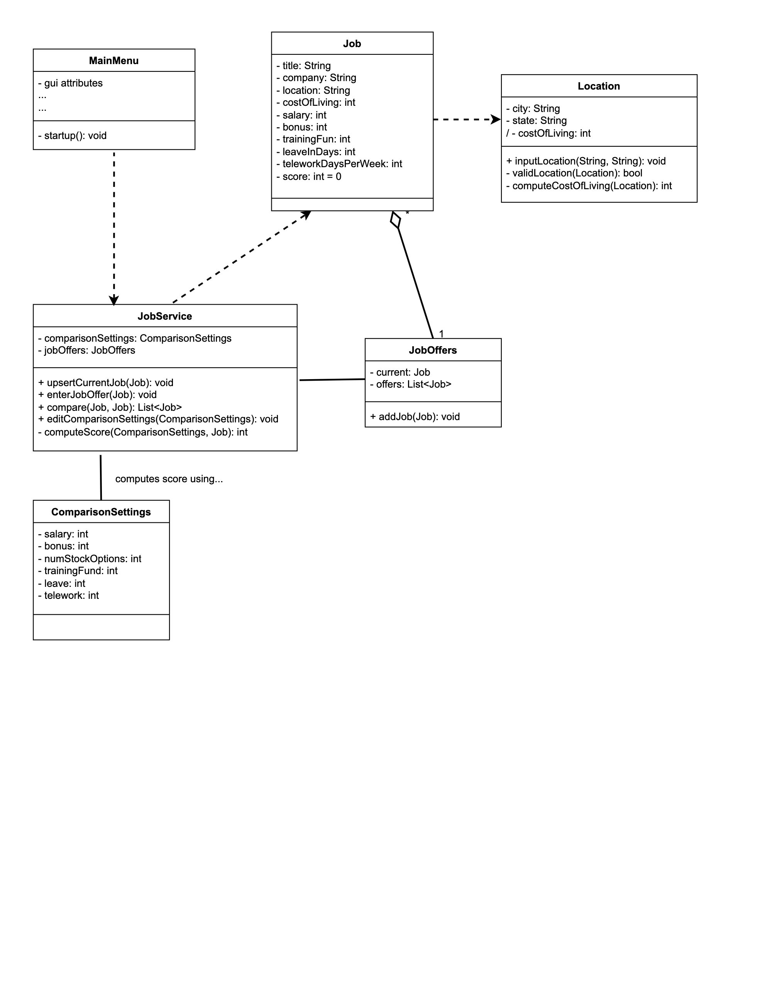
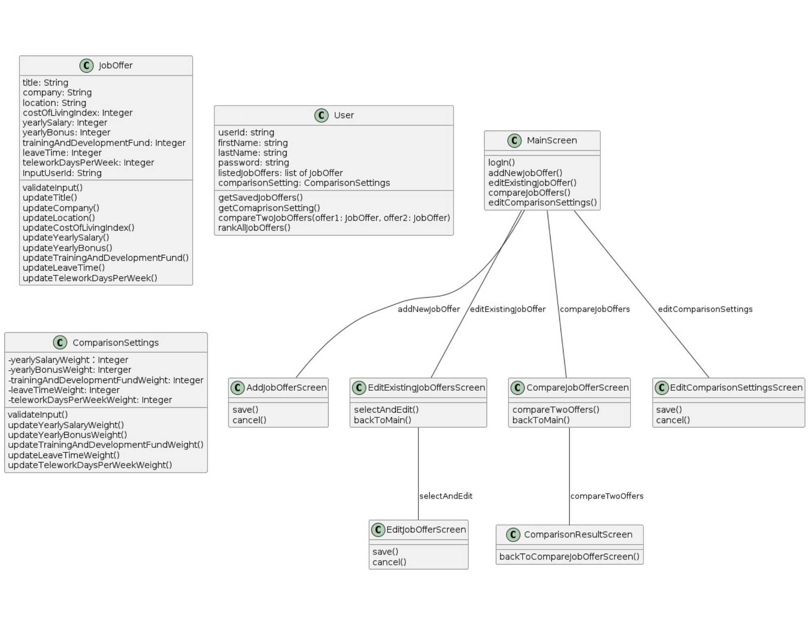
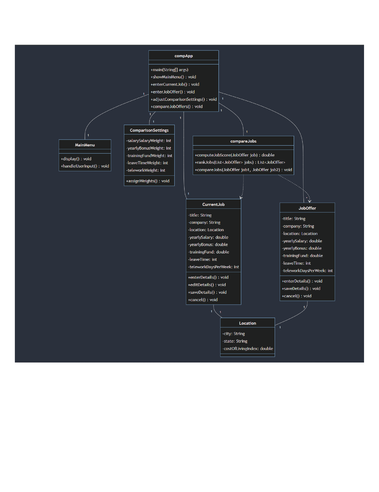
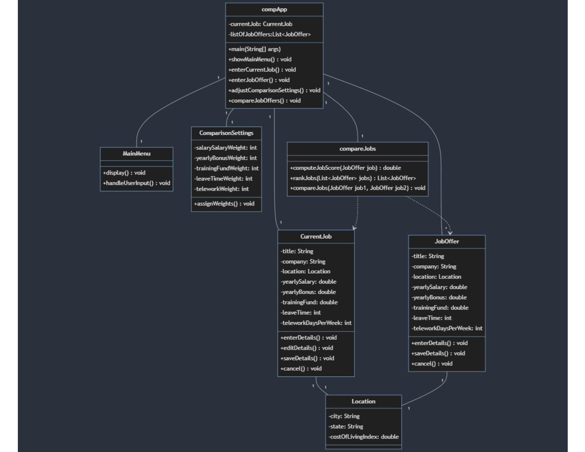

##########################################################

Design 1 - Ethan McDermott:
Discussion:

Show the user for design
Add save function
Show attributes in computeScores() for GUI
Location order not enforced in design

Pros:
Simple design

Cons:
Location order not enforced.
computeScores() not clear on operation
Need save function

##########################################################

Design 2 - Troy Lamphere:

Getters/setters needed.  
Location. costOfLiving calculated based on referencing online. Compute might be needed. JobService give score to job.  User cannot access job through GUI. Only though service

Pros:
Simple and elegant design.
Ownership clearly displayed.

Cons:
Compute function may be needed.
User cannot access job via GUI.

##########################################################

Design 3 - Baochen (Max):

User might not be needed
What happens if user opens app? Login validation. 
Fetch job offers when logging in.  
Selection to select two job offers and compare.
How did you determine what is current job? User has current job.  Cannot compare against job offers
Need current job details.  Compare new job offer to current job.  Can also compare whatever jobs you want

Add current job as job offer

Pros:

Ownership clearly displayed.
Screens for GUI shown.

Cons:
User might not be needed
Login not required
CurrentJob not displayed

##########################################################

Design 4 - Joshua:

Has save, edit and modify job details. Can adjust weights for different comparisons.  Methods to assign weights.  

Where are job offers stored?  Good question. Need to account for.

Pros:
Ownership clearly displayed. 
Clear main class.

Cons:
jobOffers not stored anywhere.
current job not stored.

##########################################################

Team Design:

Start with Joshua’s design. Use as base

Edits we want?  Where to store?  Need to edit class to show ownership of jobOffer objects.

Current job has different function.  

What else to add?
Have currentJob in maybe compApp. Add one job and list of jobOffers

Do you compute cost of living? There’s a double at bottom.  May need to compute? Input or compute?  User puts it in

Main commonalities:
All base classes and relationships inherited from Joshua's design. (Design 4)

Main differences:
jobOffers list added in compApp class that is composed of jobOffer objects.
currentjob object added in compApp class that is composed of currentJob object.

Justification:
Joshua's design clearly shows properly segregated classes and the classes' relationships to one another.
Each class owns a particular role and controls its own data structures.
The compApp class clearly owns and operates the program as the main loop function. 

##########################################################

Summary:
We learned we wanted a clear and concise design that was easy to understand. Joshua's design was the most elegant and concise out of the bunch. It clearly showed the relationships between the objects and the role each played in the overall design.  We all equally split up the work deliverables for the week and wrote down the duties of each person. 
