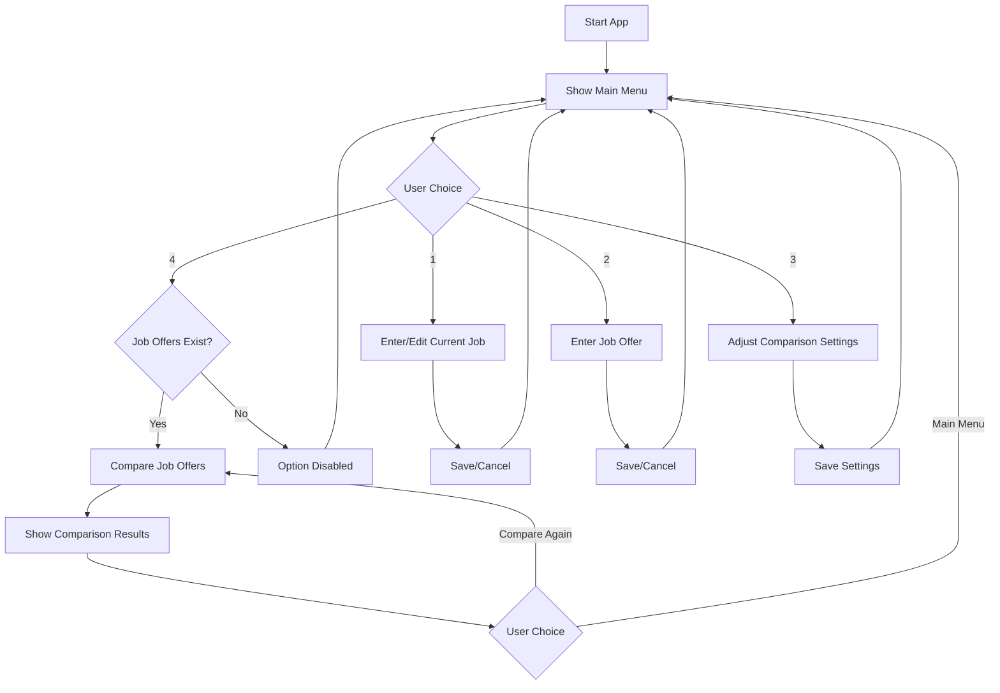
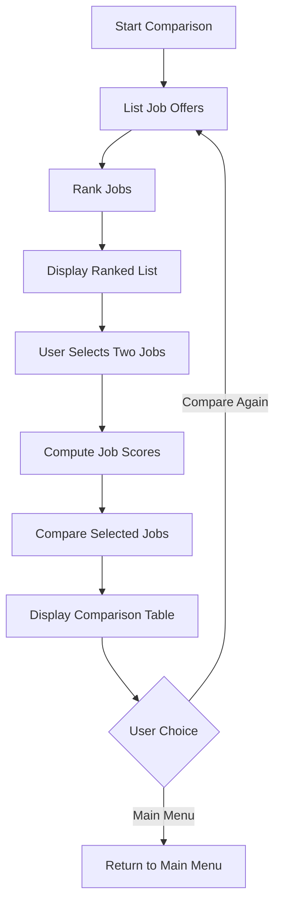

# Design Document v2

**Author**: \<Team 097\>
V2 features updated diagrams, updated discoveries, and updated information in regards to what the team has learned in the design of this application.

## 1 Design Considerations

### 1.1 Assumptions

#### Main GUI
Here are some ideas we came up with to implement the main part of the GUI.
1. Main Menu Screen:
    -   Options for: Enter/Edit Current Job, Enter Job Offer, Adjust Comparison Settings, View and Rank Job Offers
    -   View and Rank Job Offers option should be disabled if less than 2 jobs are entered
2. Job Details Entry Screen (for both current job and job offers):
    -   Input fields for: Title, Company, City, State, Cost of Living Index, Yearly Salary, Yearly Bonus, Training and Development Fund, Leave Time, Telework Days per Week
    -   Save and Cancel buttons
    -   For Job Offer Details entry screen additional two buttons: Save and Create New One, Compare Job Offer with Current Job
3. Comparison Settings Screen:
    -   Fields for weights (0-9) for: Yearly Salary, Yearly Bonus, Training and Development Fund, Leave Time, Telework Days per Week
    -   Save button
4. Job Comparison Screen:
    -   List of job offers ranked from best to worst
    -   Option to select two jobs for detailed comparison
    -   Detailed comparison table showing all job details for the selected jobs
    -   Option to return to previous screen
    -   Options to delete jobs, other than current job

#### Initial Assumptions
Below are some initial assumptions we made just to make the development process a bit easier. Most suggestions were premised on the fact that we would be working with junk data and strict time constraints.

1. We assume the app is designed for a single user and doesn't require multi-user functionality or authentication.
2. The app doesn't require persistent storage between sessions, implying that data is stored in memory during runtime.
3. We assume the app should run on various platforms without specifying a particular operating system or environment.
4. We assume that the provided job details are sufficient for comparison, and no additional factors are needed.
5. All monetary values (salary, bonus, etc.) are assumed to be in the same currency.
6. We assume users understand basic job offer components and can input accurate data.
#### Potential Pain Points

We've identified a few pain points with this app given our initial assumptions. Many of our issues stem from a lack of data persistence and error catching based on user or system inputs.

1. Without persistent storage, users will need to re-enter data each time they use the app, which could be inconvenient.
2. Ensuring users input valid data (e.g., numeric values for salary, integer values for leave time) will be crucial.
3. If the number of job offers grows large, the ranking and comparison algorithms may need optimization.
4. Ensuring the UI remains responsive, especially during calculations and comparisons, could be challenging.
5. Calculations involving money and cost of living adjustments may require the handling of floating-point arithmetic to avoid rounding errors.

#### Project configurations

There are a few general things to consider when configuring a project. These involve picking the stack, developing a work breakdown structure, and following proper coding/software engineering practices. Below are some points we feel are important from a general software engineering perspective.

1. Choosing a technology stack that allows for easy cross-platform development (if required) could be challenging.
2.  Selecting an appropriate UI framework that can create an intuitive and responsive interface across different platforms.
3. Implementing a comprehensive testing strategy, including unit tests and UI tests, may require additional tooling.
4. Ensuring proper version control and collaboration practices if multiple developers are working on the project.
5. Structuring the code to allow for easy maintenance and potential future extensions of the app's functionality.
6. Ensuring efficient algorithms for job ranking and comparison, especially if the app needs to handle a large number of job offers.
### 1.2 Constraints

Most of our constraints are directly tied to things we've identified as pressure points during the development process.

1.  The system must maintain an intuitive and responsive user interface, even when performing complex calculations or handling multiple job offers. This constraint influences our choice of UI framework and how we structure our computation logic.
2. The application should be platform-independent, capable of running on various desktop operating systems.
3.  The system is constrained by the specific job details outlined in the requirements. We cannot expand beyond these parameters without modifying the core design, which limits the flexibility of job comparisons.
4. The job score calculation must adhere to the specified weighted average formula.
5.  Comparison weights must be integer values from 0 to 9. This constraint simplifies user input but may limit the granularity of data.
6.  As a single-system application without persistent storage, the app must efficiently manage memory usage, especially when handling multiple job offers.
7.  The system should be able to handle a reasonable number of job offers without significant performance degradation.
8. The application must function without requiring an internet connection, limiting our ability to incorporate external data sources or cloud-based features.

### 1.3 System Environment

**Hardware:**

-   The system should run on desktop or laptop computers.
-   No specific hardware requirements beyond what's typical for a modern personal computer.
-   Minimum recommended specifications: 2GB RAM, 1GHz dual-core processor, 100MB free storage space.

**Software:**

-  The application should be OS agnostic.
-  Depending on the chosen technology stack, the system may require a specific runtime environment (e.g., Java Runtime Environment, Node.js, .NET Framework).
-  The application will interact with the operating system's native windowing system.
-  Local file system access may be required for saving and loading application data, depending on whether we implement data persistence.

**External Dependencies:**

-   The system is designed to operate as a standalone application without requiring external services or databases.
-   No internet connection is required for core functionality.

**Development Environment:**

-   The development team will need appropriate IDEs and build tools compatible with the chosen technology stack.
-   Version control system (e.g., Git) for collaborative development.
-   Testing frameworks for implementing unit and integration tests.

## 2 Architectural Design

The job comparison application follows a modular architecture to keep data secure and manageable. The high-level design consists of several interconnected components, each responsible for specific functionalities.

### 2.1 Component Diagram

We're basing our components on this flowchart.

  ```mermaid
graph TD
    A[1: User Interface] --> B[2: Main Controller]
    B --> C[3: Job Data Manager]
    B --> D[4: Comparison Engine]
    B --> E[5: Settings Manager]
    C --> F[6: Data Storage]
    D --> C
    E --> F
    
    style A fill:#f9f,stroke:#333,stroke-width:2px
    style B fill:#bbf,stroke:#333,stroke-width:2px
    style C fill:#dfd,stroke:#333,stroke-width:2px
    style D fill:#fdd,stroke:#333,stroke-width:2px
    style E fill:#ddf,stroke:#333,stroke-width:2px
    style F fill:#ffd,stroke:#333,stroke-width:2px
  ```

A more detailed component diagram is given below.


1. Handles all user interactions and display of information. It includes screens for the main menu, job detail entry, comparison settings, and job comparison results.
2. Coordinates the flow of data and operations between other components. It processes user inputs from the UI and delegates tasks to appropriate components.
3. Responsible for creating, reading, updating, (both current job and job offers) and deleting job data (job offers). It interacts with the Data Storage component to manage this information.
4. Implements the logic for ranking jobs and performing detailed comparisons based on the specified formula and weights.
5. Handles the storage and retrieval of user-defined comparison settings (weights for different factors).
6. Represents the in-memory data structure for storing job information and settings during the application's runtime.
### 2.2 Deployment Diagram

This application is handled locally and doesn't interact with other systems, so it's difficult to come up with a deployment diagram for it. Our justification for not including one here is as follows:

The entire application runs on a single device (mobile android device) and doesn't require distribution across multiple hardware components or servers. It doesn't rely on external databases, web services, or other remote resources that would necessitate a deployment strategy.

All components of the application run within the same process and memory space, eliminating the need for inter-process or network communication. Due to the straightforward nature of the application, the level of complexity is simpler than what would be typically addressed in larger, distributed systems.

## 3 Low-Level Design

### 3.1 Class Diagram

  ```mermaid
classDiagram

class  MainActivity  {
    +EnterOrUpdateCurrentJob() void
    +EnterJobOffer() void
    +ViewAndRankJobs() void
    +AdjustComparisonSettings() void
    }


class JobOffer {
    String id
    String title
    String company
    Location location
    double yearlySalary
    double yearlyBonus
    double trainingFund
    int leaveTime
    int teleworkDaysPerWeek
    String getId()
    String getTitle()
    String getCompany()
    double getYearlySalary()
    double getYearlySalaryColAdjusted()
    double getYearlyBonus()
    double getYearlyBonusColAdjusted()
    double getTrainingFund()
    int getLeaveTime()
    int getTeleworkDaysPerWeek()
    int getColIndex()
    String getState()
    String getCity()
    JobForComparison toJobForComparison()
    void saveDetails()
    }

class Location {
    String city
    String state
    int colIndex

    String getCity()
    String getState()
    int getColIndex()
    }

class JobForComparison {
    String id
    String title
    String company
    Location location
    double yearlySalary
    double yearlyBonus
    double trainingFund
    int leaveTime
    int teleworkDaysPerWeek
    boolean isCurrentJob
    double score
    String getId()
    String getTitle()
    String getCompany()
    double getYearlySalary()
    double getYearlySalaryColAdjusted()
    double getYearlyBonus()
    double getYearlyBonusColAdjusted()
    double getTrainingFund()
    int getLeaveTime()
    int getTeleworkDaysPerWeek()
    int getColIndex()
    String getState()
    String getCity()
    double getScore()
    void setScore(double score)
    boolean isCurrentJob()
}

class CurrentJobSingleton {

    String title
    String company
    Location location
    double yearlySalary
    double yearlyBonus
    double trainingFund
    int leaveTime
    int teleworkDaysPerWeek

    CurrentJobSingleton getInstance()
    + void updateCurrentJob()
    + JobForComparison toJobForComparison()
    + boolean isValid()
    + String getTitle()
    + String getCompany()
    + Location getLocation()
    + String getState()
    + String getCity()
    + int getColIndex()
    + double getYearlySalary()
    + double getYearlySalaryColAdjusted()
    + double getYearlyBonus()
    + double getYearlyBonusColAdjusted()
    + double getTrainingFund()
    + int getLeaveTime()
    + int getTeleworkDaysPerWeek()
}

class CompareJobsSingleton {

    - int yearlySalaryWeight
    - int yearlyBonusWeight
    - int trainingFundWeight
    - int leaveTimeWeight
    - int teleworkWeight

    + CompareJobsSingleton getInstance()
    + double computeJobScore(JobForComparison job)
    + List<JobForComparison> rankJobs(List<JobForComparison> jobs)
    + void assignWeights()
}

class JobOffersSingleton {
    - static JobOffersSingleton instance
    - Map<String, JobOffer> jobOffers

    + static JobOffersSingleton getInstance()
    + List<JobOffer> getJobOffers()
    + void addJobOffer(JobOffer jobOffer)
    + void removeJobOffer(String jobId)
    + JobOffer getJobOfferById(String jobId)
    + int getNumberOfJobOffers()
}

class DatabaseHelper {
    - static COLUMN
    - static TABLE
    - static DATABASE_NAME
    
    + void onCreate()
    + void onUpgrade()
}

class DatabaseHelperJobOffers {
    - static COLUMN
    - static TABLE
    - static DATABASE_NAME
    
    + void onCreate()
    + void onUpgrade()
}

class JobDatabase {
   - SQLiteDatabase database
   - SQLiteDatabase database_2
   - DatabaseHelper dbHelper
   - DatabaseHelperJobOffers dbHelperOffers
   
   + void open()
   + void close()
   + void openoffer()
   + void closeoffer()
   + long createJob()
   + long createJobOffer()
   + void deleteJobOffer()
   + List<JobOffer> getAllJobOfffers()
   + List<JobOffer> getCurrentJobOffer()
   - JobOffer cursorToJobOffer()
   - JobOffer cursorToJobOffer_2()
}

MainActivity "1" --> "1" JobOffersSingleton: updateJobOffer
MainActivity "1" --> "1" CurrentJobSingleton: updateCurrentJob
MainActivity "1" --> "1" CompareJobsSingleton: updateComparisonSettins & rankJobOffers
JobOffer --> Location : location
JobOffer --> JobForComparison : toJobForComparison
JobForComparison --> Location : location
CurrentJobSingleton --> Location : location
CurrentJobSingleton --> JobForComparison : toJobForComparison
CompareJobsSingleton --> JobForComparison : computeJobScore
JobOffersSingleton --> JobOffer : addJobOffer
DatabaseHelper --> JobDatabase
DatabaseHelperJobOffers --> JobDatabase
  ```
1. Main menu:
    -   The `MainActivity` is the central navigation point of the app, allowing users to access different functionalities. It fulfills the requirement of presenting the user with options to enter/edit current job details, enter job offers, adjust comparison settings, and compare job offers.
    - The  `MainActivity`  is the entry point of the application. The  `MainActivity`  class has methods to display the menu options and handle user input.
2. Enter/edit current job details:
    -   The  `CurrentJobSingleton`  class encapsulates the details of the user's current job. It includes attributes for each job detail mentioned in the requirements, such as title, company, location, salary, bonus, and other benefits. The class provides methods to enter, edit, save, and cancel job details.
    -   The  `CurrentJobSingleton`  class is associated with the  `MainActivity`  class. It has a one-to-one association with the  `Location`  class to represent the job location details.
3.  Enter job offers:
    -   The  `JobOffersSingleton`  class represents the details of a job offer. It has the same attributes as the  `CurrentJobSingleton`  class, allowing users to enter and save job offer details. Multiple job offers can be associated with the  `MainActivity`.
    -   The  `JobOffersSingleton`  class is associated with the  `MainActivity`  class with a one-to-many relationship. It also has a one-to-one association with the  `Location`  class.
4. Adjust comparison settings:
    -   The  `CompareJobsSingleton`  class allows users to assign weights to different factors for job comparison. It includes attributes for each factor's weight and a method to assign the weights.
    -   The  `CompareJobsSingleton`  class is associated with the  `MainActivity`  class.
5. Compare job offers:
    -   The  `JobOffers` class used in `JobOffersSingleton` class and `CurrentJobSingleton` class can be transited to `JobForComparison`  class, which has attributed, such as score and isCurrentJob, used for front end UI update. 
    -   The  `CompareJobsSingleton`  class handles the comparison logic for job offers. It includes methods to compute job scores, rank jobs based on scores, and compare two selected jobs. The class depends on the  `CurrentJob`  and  `JobOffer`  classes to perform the comparisons.
    -   The  `CompareJobsSingleton`  class is associated with the  `MainActivity`  class. It has a dependency relationship with the  `JobForComparison`  classes, indicated by the dashed arrow.
6.  Job score calculation:
    -   The  `computeJobScore()`  method in the  `CompareJobsSingleton`  class implements the weighted average formula for calculating job scores based on the provided requirements. It takes into account the adjusted salary, bonus, and other factors.
    -   The  `computeJobScore()`  method is included in the  `CompareJobsSingleton`  class.
7. Job Databases:
    -   There are two job databases, `DatabaseHelper` (for current job) and `DatabaseHelperJobOffer` (for job offers). These interact with the class `JobDatabase` which helps them to store, load, and delete data. These job database classes are used throughout the program to ensure data persists between runs.

### 3.2 Other Diagrams

Below are some prototypes of things we brainstormed based on our team discussions. These are not comprehensive or completely correct but were created to showcase our thoughts on the initial conception of the app.

**Main Menu Flow**

**Simple Job Comparison Loop**


## 4 User Interface Design

The UI is created via widgets in an Android Mobile app. Instead, here's a brief proof-of-concept just using ASCII chars.

**Basic Homepage**

    +-----------------------------------+
    |        Job Comparison App         |
    +-----------------------------------+
    | Current Job Entered:  [        ]  |
    | Number of Job Offers: [        ]  |
    +-----------------------------------+
    | 1. Enter/Edit Current Job         |
    | 2. Enter Job Offer                |
    | 3. View And Rank Job Offers       |
    | 4. Adjust Comparison Settings     |
    +-----------------------------------+
    |           Exit (Q)                |
    +-----------------------------------+

**Job Details**

    +-----------------------------------+
    |      Enter/Edit Current Job       |
    +-----------------------------------+
    | Title: [                       ]  |
    | Company: [                     ]  |
    | City: [            ]              |
    | State: [           ]              |
    | Cost of Living Index: [      ]    |
    | Yearly Salary: [               ]  |
    | Yearly Bonus: [                ]  |
    | Training Fund: [               ]  |
    | Leave Time (days): [          ]   |
    | Telework Days/Week: [         ]   |
    +-----------------------------------+
    |    [Save]      [Cancel]           |
    +-----------------------------------+

**Job Details**

    +-----------------------------------+
    |         Enter Job Details         |
    +-----------------------------------+
    | Title: [                       ]  |
    | Company: [                     ]  |
    | City: [            ]              |
    | State: [           ]              |
    | Cost of Living Index: [      ]    |
    | Yearly Salary: [               ]  |
    | Yearly Bonus: [                ]  |
    | Training Fund: [               ]  |
    | Leave Time (days): [          ]   |
    | Telework Days/Week: [         ]   |
    +-----------------------------------+
    |              [Save]               | 
    |    [Save & Enter Another One]     |
    |    [Compare With Current Job]     |
    |             [Cancel]              |
    +-----------------------------------+
**Comparison Settings**

    +-----------------------------------+
    |      Adjust Comparison Weights    |
    +-----------------------------------+
    | Yearly Salary:     [0-9]          |
    | Yearly Bonus:      [0-9]          |
    | Training Fund:     [0-9]          |
    | Leave Time:        [0-9]          |
    | Telework Days:     [0-9]          |
    +-----------------------------------+
    |    [Save Settings]   [Cancel]     |
    +-----------------------------------+

**Comparison Selection**

    +-----------------------------------------------------+
    |                   Job Offer Ranking                 |
    +-----------------------------------------------------+
    | 1. Software Engineer - TechCorp [Delete] [Select]   |
    | 2. Senior Developer - CodeInc   [Delete] [Select]   |
    | 3. Current Job                           [Select]   |
    | 4. Web Developer - WebSolutions [Delete] [Select]   |
    +-----------------------------------------------------+
    |                      [Compare]                      |
    |                      [Cancel]                       |
    +-----------------------------------------------------+

**Comparison Results**

    +-----------------------------------+
    |       Detailed Job Comparison     |
    +-----------------------------------+
    | Factor     | Job 1     | Job 2    |
    +-----------------------------------+
    | Title      | Soft. Eng.| Sr. Dev. |
    | Company    | TechCorp  | CodeInc  |
    | Location   | NYC, NY   | SF, CA   |
    | Adj. Salary| $110,000  | $130,000 |
    | Adj. Bonus | $10,000   | $15,000  |
    | Train. Fund| $5,000    | $3,000   |
    | Leave Time | 20 days   | 15 days  |
    | Telework   | 2 days/wk | 3 days/wk|
    +-----------------------------------+
    |             [Return]              |
    +-----------------------------------+

## 5 Takeaways And Final Thoughts From Project

Now that the project is complete, here are some takeaways and things we learned about the project.
1. Our initial assumption that data does not persist was incorrect.
2. Our initial assumption that this project needs to be for all operating systems was incorrect.
3. Our Android / Java skills improved tremendously.
4. We learned the importance of up-to-date documentation.
5. Designs need to be mendable for accidents, unknowns, or other discoveries along the way.
6. We learned the importance of collaboratin and communication.
7. We learned the usefulness of testing and demos.
