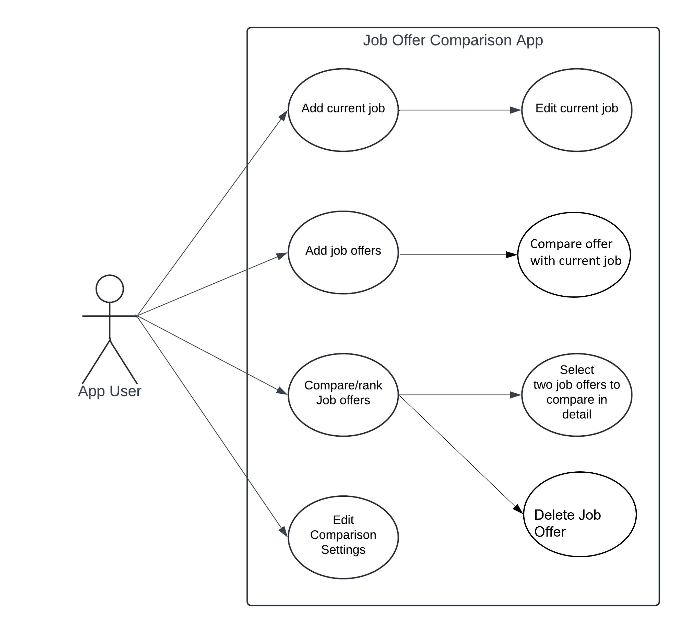

# Use Case Model v2

V2 features delete functionality

**Author**: Team 097

## 1 Use Case Diagram

## 2 Use Case Descriptions

### Use case 1
- Requirements: User can add current job.
- Pre-conditions: App must be opened and run.
- Post-conditions: A valid current job must be added to the system if user click Save.
- Scenarios:
  - If user entered invalid input, a warning prompt will pop up and tell the user which field of input is wrong
  - If user has entered a current job previously, user will be able to edit current job

### Use case 2
- Requirements: User can edit current job.
- Pre-conditions: 
  - App must be opened and run.
  - User must have entered current job
- Post-conditions: A valid and updated current job must be added to the system if user click Save.
- Scenarios:
  - If user entered invalid input, a warning prompt will pop up and tell the user which field of input is wrong
  - If user has entered a current job previously, user will be able to edit current job

### Use case 3
- Requirements: User can add multiple job offers.
- Pre-conditions: App must be opened and run.
- Post-conditions: Job offer must be added to the system if user click Save.
- Scenarios: 
  - If user entered invalid input, a warning prompt will pop up and tell the user which field of input is wrong

### Use case 4
- Requirements: User can compare job offers with current job
- Pre-conditions: 
  - App must be opened and run.
  - User must have entered a valid current job
  - User must have entered a valid job offer
- Post-conditions: Comparison result will be shown
- Scenarios: 
  - If there is no current job, this function will not be allowed
  - If there is no job offer, this function will not be allowed

### Use case 5
- Requirements: User can view and rank job offers (including current job)
- Pre-conditions:
  - App must be opened and run.
  - User must have entered at least one job offer or current job
- Post-conditions: Job will show in rank
- Scenarios:
  - If there is no current job or no job offer, this function will not be allowed

### Use case 6
- Requirements: User can delete job offer.
- Pre-conditions: App must be opened and run, User must be in the View and Rank Job Offers Screen.
- Post-conditions: A job offer must be deleted.
- Scenarios:
  - User can only delete Job offer, not current job

### Use case 7
- Requirements: User can compare two jobs
- Pre-conditions:
    - App must be opened and run.
    - User must have selected two jobs (including current job)
- Post-conditions: Comparison result will be shown
- Scenarios:
    - User must make exact two selections

### Use case 8
- Requirements: User can edit comparison settings
- Pre-conditions:
  - App must be opened and run.
- Post-conditions: A valid comparison setting is saved
- Scenarios:
  - If user enters invalid input, a warning prompt will pop up and tell the user which field of input is wrong

